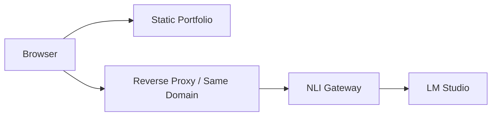

# 배포 방법

이 프로젝트는 두 부분으로 나누어 배포합니다.

1. 포트폴리오 정적 사이트
2. NLI Gateway

포트폴리오 사이트는 정적 파일만 있으면 동작하지만, 자연어 입력 기능은 NLI Gateway가 함께 실행되어야 사용할 수 있습니다.

## 배포 전 확인

배포 전에 로컬에서 다음 명령을 실행합니다.

```bash
node --check app.js
node --check data/portfolio.js
node --check tools/static-server.mjs
node --check tools/static-server.test.mjs
node --check tools/nli-gateway.mjs
node --check tools/nli-test.mjs
node --check tools/nli-gateway.test.mjs
for file in tools/nli/*.mjs; do node --check "$file"; done
node tools/nli-test.mjs
node tools/nli-test.mjs --local --cases nli/live-test-cases.json --min-pass-rate 1
node tools/nli-test.mjs --local --cases nli/adversarial-test-cases.json --min-pass-rate 1
node --test tools/nli-gateway.test.mjs
node --test tools/static-server.test.mjs
```

배포된 Gateway를 직접 호출하는 기능 검증은 다음 명령으로 실행합니다. `nli/live-test-cases.json`의 성공 18개만 호출하며, 이어지는 adversarial 8개와 합쳐 기본 30회/분 rate limit 안에서 실행되도록 구성했습니다.

```bash
NLI_TEST_BASE_URL="http://127.0.0.1:8787" node tools/nli-test.mjs --live --cases nli/live-test-cases.json --kind success --min-pass-rate 1
```

정적 서버도 한 번 확인합니다.

```bash
node tools/static-server.mjs
```

브라우저에서 접속합니다.

```text
http://127.0.0.1:4173
```

## 1. 정적 포트폴리오 배포

정적 사이트 배포 대상은 다음 파일과 폴더입니다.

```text
index.html
styles.css
app.js
data/
assets/
```

GitHub Pages, Vercel, Netlify, Nginx 같은 정적 호스팅에 올릴 수 있습니다.

### GitHub Pages 예시

1. GitHub 저장소에 변경사항을 push합니다.
2. 저장소의 `Settings`로 이동합니다.
3. `Pages` 메뉴에서 배포 소스를 선택합니다.
4. 브랜치는 `main`, 폴더는 `/ (root)`를 선택합니다.
5. 배포 URL이 생성되면 포트폴리오 화면을 확인합니다.

## 2. NLI Gateway 배포

NLI Gateway는 Node.js 서버입니다. LM Studio가 떠 있는 같은 네트워크에서 실행하는 방식을 기준으로 합니다.

필요한 환경 변수:

```text
NLI_HOST=0.0.0.0
NLI_PORT=8787
LM_STUDIO_BASE_URL=http://192.168.0.58:1234/v1
LM_STUDIO_MODEL=google/gemma-4-e4b
LM_STUDIO_TIMEOUT_MS=8000
NLI_MAX_REQUEST_BYTES=16384
NLI_MAX_MESSAGE_LENGTH=500
NLI_RATE_LIMIT_WINDOW_MS=60000
NLI_RATE_LIMIT_MAX=30
NLI_RATE_LIMIT_MAX_BUCKETS=10000
NLI_REQUEST_TIMEOUT_MS=15000
NLI_TRUST_PROXY=false
NLI_ALLOWED_ORIGINS=https://your-portfolio.example
LM_STUDIO_MAX_TOKENS=256
LM_STUDIO_MAX_RESPONSE_BYTES=65536
LM_STUDIO_MAX_CONCURRENT_REQUESTS=4
```

서버에서는 `.env.example`을 `.env`로 복사한 뒤 값을 수정해서 사용할 수 있습니다. `tools/nli-gateway.mjs`는 시작할 때 프로젝트 루트의 `.env` 파일을 자동으로 읽습니다.

```bash
cp .env.example .env
```

실행:

```bash
node tools/nli-gateway.mjs
```

상태 확인:

```text
http://서버주소:8787/api/nli/health
```

정상이라면 `ok: true`와 라우트/용어 개수만 응답에 포함됩니다. 내부 LM Studio 주소와 모델명은 health 응답으로 노출하지 않습니다.

## 3. GitHub Actions로 NLI Gateway 자동 배포

내부망 서버 `192.168.0.90`에 배포하려면 GitHub-hosted runner가 아니라 내부망에 접근 가능한 컴퓨터에 GitHub Actions self-hosted runner가 설치되어 있어야 합니다. 현재 workflow는 runner 라벨 `self-hosted`, `Linux`, `X64`를 대상으로 실행됩니다. 해당 runner에서는 `bash`, `ssh`, `curl` 명령을 사용할 수 있어야 합니다.

배포 흐름:

```text
GitHub Actions self-hosted runner
-> SSH 접속
-> 192.168.0.90 NLI Gateway 서버
-> push 이벤트의 정확한 commit checkout
-> Gateway restart
-> 5초 간격으로 최대 3회 health check
-> 기능 live test와 adversarial live test
```

workflow 파일:

```text
.github/workflows/deploy-nli-gateway.yml
```

GitHub 저장소 `Settings > Secrets and variables > Actions`에 아래 secrets를 등록합니다.

필수:

```text
NLI_GATEWAY_USER=서버 SSH 사용자명
NLI_GATEWAY_SSH_KEY=서버 접속용 private key
NLI_GATEWAY_KNOWN_HOSTS=192.168.0.90 서버의 SSH host public key
```

선택:

```text
NLI_GATEWAY_HOST=192.168.0.90
NLI_GATEWAY_PORT=8787
NLI_GATEWAY_SSH_PORT=22
NLI_GATEWAY_APP_DIR=~/portfolio-nli
NLI_GATEWAY_PROCESS=portfolio-nli-gateway
```

서버에는 repository가 이미 clone되어 있어야 하며, `NLI_GATEWAY_APP_DIR`은 해당 repository 경로를 가리켜야 합니다.

`NLI_GATEWAY_KNOWN_HOSTS`는 최초 접속 시점에 host key를 받아들이는 `ssh-keyscan`을 대체하는 필수 pinning 값입니다. 서버에서 아래 명령으로 값을 만들고 GitHub Secret에 그대로 넣습니다.

```bash
awk '{ print "192.168.0.90 " $1 " " $2 }' /etc/ssh/ssh_host_ed25519_key.pub
```

출력 예시는 아래 형태입니다.

```text
192.168.0.90 ssh-ed25519 AAAAC3...
```

```bash
git clone https://github.com/mixedsider/portfolio-nli.git ~/portfolio-nli
cd ~/portfolio-nli
cp .env.example .env
```

Gateway 프로세스는 `pm2` 또는 user systemd service 중 하나로 관리합니다. 기본 권장은 `pm2`입니다.

```bash
pm2 start tools/nli-gateway.mjs --name portfolio-nli-gateway --update-env
pm2 save
```

배포 workflow는 `main` 브랜치에 Gateway 관련 파일이 push될 때만 자동 실행됩니다. `workflow_dispatch`는 self-hosted runner에서 임의 branch 코드를 실행할 수 있으므로 사용하지 않습니다. `main`은 branch protection과 승인된 변경만 병합하도록 설정합니다. 배포 전 self-hosted runner에서 소스 문법, fixture, fake LM Studio/HTTP 통합 테스트를 다시 실행합니다. 서버는 이동하는 `main`이 아니라 push 이벤트의 정확한 commit으로 checkout하며, health·live test 실패 시 직전 commit으로 rollback합니다. 기능 live test는 성공 fixture를 100% 요구하고, prompt injection·외부 주제 혼동을 담은 adversarial test도 100%를 요구합니다.

## 4. 프론트와 Gateway 연결

현재 MVP의 프론트엔드 NLI 요청 주소는 `app.js`에 있습니다.

```js
const nliEndpoint = "https://portfolio-nli-gateway.mixedsider.cloud/api/nli";
```

로컬 Gateway를 검증할 때만 이 값을 `http://127.0.0.1:8787/api/nli`로 바꿉니다. 운영 배포에서는 HTTPS Gateway 주소 또는 아래와 같은 같은 도메인 경로를 사용합니다.

외부 배포에서는 브라우저가 접근할 수 있는 Gateway 주소로 바꿔야 합니다.

예시:

```js
const nliEndpoint = "https://portfolio.example.com/api/nli";
```

권장 운영 구조는 정적 사이트와 NLI Gateway를 같은 도메인 뒤에 두는 방식입니다.



같은 도메인으로 묶으면 CORS, HTTPS, 브라우저 접근 주소 관리가 단순해집니다. 다른 origin에서 호출해야 한다면 `.env`의 `NLI_ALLOWED_ORIGINS`에 실제 정적 사이트 origin만 쉼표로 구분해 등록합니다. Gateway는 이 값이 비어 있으면 브라우저 origin 요청을 거부하고, 배포 workflow도 비어 있거나 `*`인 운영 설정을 rollback합니다. `*`는 명시적인 로컬 개발 환경에서만 사용합니다.

`NLI_TRUST_PROXY=true`는 신뢰할 수 있는 리버스 프록시가 `X-Forwarded-For`를 직접 설정하고 외부 클라이언트의 해당 헤더를 덮어쓰는 경우에만 사용합니다. 기본값 `false`에서는 Gateway가 TCP 원격 주소 기준으로 rate limit을 적용합니다. public Gateway는 process 내 rate limit 외에 reverse proxy/CDN의 rate limit도 함께 설정하는 것이 좋습니다.

## 5. Nginx 리버스 프록시 예시

정적 사이트와 Gateway를 같은 도메인에서 제공하려면 Nginx를 사용할 수 있습니다.

```nginx
server {
    listen 80;
    server_name portfolio.example.com;

    root /var/www/portfolio;
    index index.html;

    location / {
        try_files $uri $uri/ /index.html;
    }

    location /api/nli {
        proxy_pass http://127.0.0.1:8787/api/nli;
        proxy_http_version 1.1;
        proxy_set_header Host $host;
        proxy_set_header X-Real-IP $remote_addr;
        proxy_set_header X-Forwarded-For $remote_addr;
    }
}
```

이 구성을 사용할 경우 `app.js`의 요청 주소는 같은 도메인 기준으로 바꿀 수 있습니다.

```js
const nliEndpoint = "/api/nli";
```

## 6. 배포 후 확인

1. 포트폴리오 페이지가 열리는지 확인합니다.
2. 이미지가 정상적으로 보이는지 확인합니다.
3. NLI 상태 API를 확인합니다.
4. 포트폴리오 오른쪽 아래 입력창에서 다음 문장을 테스트합니다.

```text
DB 최적화 보여줘
P95가 뭐야?
오늘 날씨 알려줘
```

기대 동작:

- `DB 최적화 보여줘`: DB 성능 최적화 섹션으로 이동
- `P95가 뭐야?`: 사전 기반 용어 설명 표시
- `오늘 날씨 알려줘`: 포트폴리오 범위 밖 요청으로 거절
