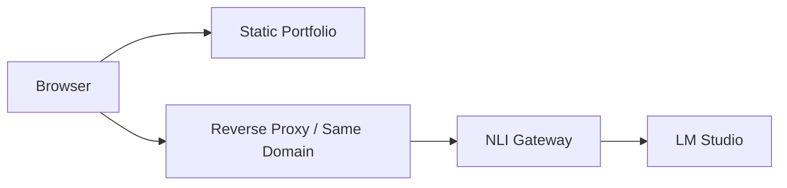

# 배포 방법

이 프로젝트는 두 부분으로 나누어 배포합니다.

1. 포트폴리오 정적 사이트
2. NLI Gateway

포트폴리오 사이트는 정적 파일만 있으면 동작하지만, 자연어 입력 기능은 NLI Gateway가 함께 실행되어야 사용할 수 있습니다.

**현재는 activation-blocked / ready=false이며 이 작업은 배포 승인이 아닙니다.** 이전 전체 평가(당시 설정)는 **2026-09-09 18:54:03.743Z**에 완료된 projected-payload full matrix입니다. 당시 bound LFM/Qwen verify와 evaluator는 모두 exit 1이며, 당시 실제 결과는 success **5/26**, adversarial **7/10**, **LFM 채택 0건**, Qwen receipt 없음입니다. 그 이전 실제 실행도 5/26·7/10이었으나 서로 다른 입력/시점의 실제 실패 기록이며 재사용하거나 향후 결과로 단정하지 않습니다. 일반 페이지 명사 관련 fake9/10 semantic 문제는 **task4fix3에서 해결**됐고 현재 offline adversarial 기대값은10/10입니다. 당시 실제 세 adversarial 실패는 completion을 받지 못한 upstream 실패이며 그 semantic 결함의 재발 증거가 아닙니다. 이후 새 모델 ID의 [2026-09-13 제한 실측 및 이동 이력](../.omo/evidence/lfm25-middle-model/lfm-loaded-model-adoption-20260913T065843Z.md)은 별도 기록입니다. 최소 JSON의 495ms는 유효 JSON 확인일 뿐 포트폴리오 채택이 아니며, 자기소개 3,921ms 한 건만 공유 acceptance를 통과했습니다. 추가 대표 5개는 timeout, 한 번의 bound verify는 0/12 채택·exit 1로 full ready 미충족입니다.

최신 로컬 증거: `.omo/evidence/lfm25-middle-model/task12-projected-summary.md`, `task12-projected-live-eval.json`, `task12-projected-lfm-verify.json`, `task12-projected-qwen-verify.json`, 현재 `task-12-contract.md`. 새 full report에는 natural-difficult 결과도 포함됩니다. 초기 `task-12-DoneClaim.md`, `task-12-attempt-1-live-eval.json`, 별도 보충 `task-12-attempt-1-difficult-live.json`과 당시 scope diagnostic은 과거 snapshot 기록으로만 유지합니다. `.omo/`는 gitignored이며 공개 문서 링크만으로 증거가 배포되지는 않습니다.

이전 전체 평가(당시 설정)에서 944-byte grounded profile을 포함한 projected 요청도 고정 LFM4초/Qwen8초 안에 completion headers를 받지 못했습니다. metadata 접근 성공은 모델 readiness가 아니며 정확한 remote prefill/generation/queue/alias/proxy/network 원인은 미확정입니다. 당시 genuine LFM 채택은0→0, Qwen18개 clean proof/receipt도 없습니다. 당시 한 번씩의 fallback/timeout 관측이나4초 대8초 실패 시간은 accepted-model latency 분포 또는 속도 향상이 아닙니다. 이 문서 수정 때문에 추가 LAN 실행을 하지 않았으며, 승인된 새로운 serving 근거와 모든 strict gate 통과가 필요합니다.

## 배포 전 확인

배포 전에 로컬에서 다음 명령을 실행합니다.

```bash
for file in app.js nli-history.js nli-widget.js data/portfolio.js tools/*.mjs; do node --check "$file"; done
for file in tools/nli/*.mjs; do node --check "$file"; done
node -e "for (const f of ['nli/routes.json','nli/glossary.json','nli/intents.json','nli/response.schema.json','nli/model-decision.schema.json','nli/test-cases.json','nli/live-test-cases.json','nli/adversarial-test-cases.json','nli/grounded-category-test-cases.json','nli/cascade-test-cases.json','nli/model-probe-cases.json']) JSON.parse(require('fs').readFileSync(f,'utf8')); console.log('json ok')"
node tools/nli-test.mjs --local --cases nli/test-cases.json --min-pass-rate 1
node tools/nli-test.mjs --local --cases nli/live-test-cases.json --min-pass-rate 1
node tools/nli-test.mjs --fake --cases nli/grounded-category-test-cases.json --min-pass-rate 1
node tools/nli-test.mjs --fake --cases nli/cascade-test-cases.json --min-pass-rate 1
node tools/nli-test.mjs --local --cases nli/adversarial-test-cases.json --min-pass-rate 1
node --test tools/*.test.mjs
node --test tools/nli/*.test.mjs
node --test tools/nli-widget.browser-test.mjs
```

기본 환경에서 `tools/nli-widget.browser-test.mjs`는 Chrome-capable Playwright module이 없으면 명시적으로 skip됩니다. 실제 브라우저 회귀를 실행할 때는 `NLI_WIDGET_BROWSER_MODULE=/absolute/path/to/playwright-module.mjs node tools/nli-widget.browser-test.mjs`를 사용합니다.

배포된 Gateway를 직접 호출하는 기능 검증은 다음 명령으로 실행합니다. `nli/live-test-cases.json`의 성공 26개만 호출합니다.

```bash
NLI_TEST_BASE_URL="http://127.0.0.1:8787" node tools/nli-test.mjs --live --cases nli/live-test-cases.json --kind success --min-pass-rate 1 --timeout-ms 30000
sleep 60 # 기본 rate-limit window 분리; 운영 limit을 높이지 않음
NLI_TEST_BASE_URL="http://127.0.0.1:8787" node tools/nli-test.mjs --live --cases nli/adversarial-test-cases.json --min-pass-rate 1 --timeout-ms 30000
```

After every production deployment, run the 26 successful named-project regressions. It must finish with a 100% pass rate and stays within the default 30-request rate-limit budget. `tools/nli-test.mjs` makes this direct check without an `Origin` header; keep `NLI_ALLOWED_ORIGINS` configured for the actual portfolio browser origin rather than using `*` in production.

```powershell
node tools/nli-test.mjs --live --base-url https://portfolio-nli-gateway.mixedsider.cloud/api/nli --cases nli/live-test-cases.json --kind success --min-pass-rate 1 --timeout-ms 30000
```

정적 서버도 한 번 확인합니다.

```bash
node tools/static-server.mjs
```

브라우저에서 접속합니다.

```text
http://127.0.0.1:4173
```

## 1. 정적 포트폴리오 배포

정적 사이트 배포 대상은 다음 파일과 폴더입니다.

```text
index.html
styles.css
app.js
data/
assets/
```

GitHub Pages, Vercel, Netlify, Nginx 같은 정적 호스팅에 올릴 수 있습니다.

### GitHub Pages 예시

1. GitHub 저장소에 변경사항을 push합니다.
2. 저장소의 `Settings`로 이동합니다.
3. `Pages` 메뉴에서 배포 소스를 선택합니다.
4. 브랜치는 `main`, 폴더는 `/ (root)`를 선택합니다.
5. 배포 URL이 생성되면 포트폴리오 화면을 확인합니다.

## 2. NLI Gateway 배포

NLI Gateway는 Node.js 서버입니다. LM Studio가 떠 있는 같은 네트워크에서 실행하는 방식을 기준으로 합니다.

필요한 환경 변수:

```text
NLI_HOST=0.0.0.0
NLI_PORT=8787
LM_STUDIO_BASE_URL=http://192.168.0.57:1234/v1
LM_STUDIO_MODEL=Qwen3.8-27B-UD-Q4_K_M
LM_STUDIO_TIMEOUT_MS=16000
NLI_MAX_REQUEST_BYTES=16384
NLI_MAX_MESSAGE_LENGTH=500
NLI_RATE_LIMIT_WINDOW_MS=60000
NLI_RATE_LIMIT_MAX=30
NLI_RATE_LIMIT_MAX_BUCKETS=10000
NLI_REQUEST_TIMEOUT_MS=15000
NLI_TRUST_PROXY=false
NLI_ALLOWED_ORIGINS=https://your-portfolio.example
LM_STUDIO_MAX_TOKENS=768
LM_STUDIO_MAX_RESPONSE_BYTES=65536
LM_STUDIO_MAX_CONCURRENT_REQUESTS=4
LM_STUDIO_OUTPUT_MODE=json_schema
LFM_BASE_URL=http://192.168.0.106:1234/v1
# GTX1060-optimized loaded Q4_0 model, not the unloaded @q4_0 alias.
LFM_MODEL=lfm2.5-2.6b
LFM_TIMEOUT_MS=6500
LFM_MAX_TOKENS=512
LFM_MAX_RESPONSE_BYTES=65536
LFM_MAX_CONCURRENT_REQUESTS=4
LFM_OUTPUT_MODE=json_schema
NLI_CASCADE_TIMEOUT_MS=23500
NLI_CASCADE_MAX_CONCURRENT_REQUESTS=4
NLI_QWEN_ENABLED=true
NLI_QWEN_VERIFICATION_FILE=.nli/qwen-no-thinking.json
```

`LM_STUDIO_*`/`config.model`은 Qwen 승격 설정이며 LFM과 독립입니다. 두 mode는 최종 유지값 `json_schema`입니다. 현재 실패를 숨기기 위한 plain 전환/재시도 또는 cap 증가는 하지 않습니다. Qwen은 `reasoning_effort: "none"`과 `chat_template_kwargs: { enable_thinking: false }`를 고정 전송하며 환경 변수로 thinking toggle을 제공하지 않습니다. 요청 옵션 또는 reasoning counter 부재만으로 검증 성공을 판단하지 않습니다.

기본 정상 요청은 LFM입니다. 정확한 전체 명령 `도움말`, `사용법`, `연락처`, `연락처 보여줘`와 유일한 등록 label/alias 뒤 선택적 공백 + 정확히 `로 이동`/`으로 이동`/`보여줘`만 local fast path입니다. NFKC, trim, Latin case-fold, 공백 축약만 하며 구두점/보이지 않는 문자를 지우지 않습니다. 모호한 `소개로 이동`, 용어 정의, 요약, 의역, 복합 요청은 LFM에 갑니다. 보안 거절과 explicit offline `useModel:false`는 별도입니다.

LFM이 이미 충족한 답변은 낮은 confidence라도 그대로 종료합니다. 비교/종합/근거 있는 모호성이 미해결이고 coverage·검증 receipt·잔여 시간·입장 조건이 충족될 때만 Qwen 한 번을 호출합니다. ordinary timeout/JSON 실패만으로 승격하지 않습니다. 모델 요약은 `answer_portfolio`의 source 버튼으로 이동하며 자동 스크롤하지 않습니다. legacy offline summary만 기존 동작을 유지합니다.

LFM 6,500ms/512 tokens와 Qwen 16,000ms/768 tokens는 성능 약속이 아닌 제한입니다. 단일 기준은 `tools/nli/timeout-policy.mjs`입니다. resolver 진입부터 전체 23,500ms clock에는 context, retrieval, admission과 Qwen metadata가 포함되며, metadata 최대 1,000ms도 Qwen 16,000ms stage 안에서 소모됩니다. 응답 여유는 1,000ms이고 각 stage는 `min(stage cap, configured timeout, remaining - 1000ms)`이며 Qwen에는 최소 2,000ms가 필요합니다. 평가 HTTP caller 기본값은 30,000ms입니다. `NLI_REQUEST_TIMEOUT_MS=15000`은 inbound HTTP body/header 수신 제한일 뿐 응답 deadline이 아닙니다. 요청당 최대 두 순차 추론, endpoint별/공유 최대 네 active operation, queue/repair/retry 없음입니다. client abort가 원격 GPU 중단을 증명하지는 않습니다. 두 모델과 fallback은 scope·intent·coverage 조건을 지키지만 보수적 grounding이 임의의 semantic entailment를 보장하지는 않습니다.

서버에서는 `.env.example`을 `.env`로 복사한 뒤 값을 수정해서 사용할 수 있습니다. `tools/nli-gateway.mjs`는 시작할 때 프로젝트 루트의 `.env` 파일을 자동으로 읽습니다.

```bash
cp .env.example .env
```

실행:

```bash
node tools/nli-gateway.mjs
```

상태 확인:

```text
http://서버주소:8787/api/nli/health
```

health는 process/context와 release revision 검사입니다. HTTP 200/`ok:true`, `/props`, 모델 목록 또는 endpoint health 성공은 **모델 readiness가 아닙니다**. 내부 모델 주소/이름을 health로 노출하지 않습니다. receipt가 없어도 LFM/local degraded 서비스와 health 200은 가능하지만 full deployment 검증은 실패해야 합니다.

### 모델 활성화 preflight: Gateway host에서만

아래 명령은 **실제 두 모델 inference를 발생**시키므로 별도 운영 승인 후 network-capable Gateway host에서만 실행합니다. 이 task13에서는 실행하지 않습니다. Gateway와 같은 checkout/cwd, Node, 실제 PM2/systemd process 환경을 사용하세요. 비어 있지 않은 process env가 `.env`보다 우선합니다. 단순 SSH login shell에서 `.env`만 읽는 것은 동일 설정 검증이 아닙니다. 새 `eval-bound-probe.mjs` adapter는 LFM/Qwen 각각의 전체 현재 config settings와 실제 runtime payload를 사용합니다. 일반 `nli-model-probe.mjs` report나 과거 report는 새 evaluator qualification을 대신할 수 없습니다.

```bash
# 기존 repository root에서 실행. 새 디렉터리 및 파일 이름을 사용하고 기존 .env를 덮어쓰지 않음.
umask 077
mkdir -p .nli
RUN_DIR="$(mktemp -d "$PWD/.nli/manual-preflight-XXXXXXXX")"
node tools/nli/eval-bound-probe.mjs --endpoint qwen --mode verify --output "$RUN_DIR/qwen-verify.json" --receipt .nli/qwen-no-thinking.json &&
node tools/nli/eval-bound-probe.mjs --endpoint lfm --mode verify --output "$RUN_DIR/lfm-verify.json" &&
node tools/nli-cascade-eval.mjs --output "$RUN_DIR/live-eval.json" --lfm-verification "$RUN_DIR/lfm-verify.json" --qwen-verification "$RUN_DIR/qwen-verify.json"
```

- `--receipt`는 **실제 `NLI_QWEN_VERIFICATION_FILE` 경로**와 일치시켜야 합니다. 기본 상대 경로는 workspace 기준이며 launch cwd 기준이 아닙니다. 출력/receipt parent는 먼저 존재해야 합니다. report는 서로 다른 새 파일로 exclusive 0600 생성되며 기존 파일/symlink를 덮어쓰지 않습니다. CLI에 `--help`는 없으며 지원 flags는 parser와 위 명령을 기준으로 합니다.
- **bound-probe Qwen `--mode verify --receipt`는 기존 probe의 atomic 발급 API를 호출**합니다. 6종 × 3회 = 18개의 clean stop-terminated visible JSON, 실제 닫힌 빈 think template, model/build/template identity를 확인하고 0600 임시 파일 + fsync + atomic rename합니다. proof 실패는 새 receipt를 발급하지 않습니다. adapter의 사후 binding 검사까지 실패하면 receipt가 있더라도 rollout을 차단하고 checkpoint로 복원합니다. baseline과 cascade eval은 발급 도구가 아닙니다.
- receipt 최대 age는 24시간입니다. 재시작, model/build/template, prompt/schema bytes, Qwen request settings 또는 output mode 변경 후 새 Qwen 검증을 수행합니다. 실제 승격 직전 `/props`/`/apply-template` fingerprint 재검증은 최대 1,000ms이며 Qwen 16초 단일 stage 예산 안에 포함됩니다. Issue #6의 LFM timeout 변경은 LFM settings binding을 바꾸므로 fresh LFM bound report가 필요합니다. LFM/전체/평가 timeout 변경만으로 Qwen settings/payload binding은 바뀌지 않습니다. Qwen proof/receipt는 나머지 binding, matrix, freshness와 runtime gate가 모두 일치할 때만 재사용 가능합니다. 전체 application 상한/기본값은 23,500ms (LFM 6.5초 + Qwen 16초 + 응답 여유 1초)이며 더 작은 명시적 timeout은 유지합니다. `NLI_REQUEST_TIMEOUT_MS=15000`은 inbound HTTP body/header 수신 제한이며 response deadline이 아닙니다. 승격 최소 잔여 2,000ms, 공유 동시 작업 4, 최대 순차 추론 2회는 그대로입니다. missing/stale/mismatched receipt, unknown proof, metadata 실패, reasoning 위반은 Qwen을 차단합니다. missing reasoning usage는 unknown이며 0으로 바꾸지 않습니다. 이것은 비정상 서버에 대한 암호학적 attestation이 아닙니다.
- 현재 timestamp, requested/returned model, prompt/schema, settings와 mode에 묶인 **이번 실행의** verify report를 사용합니다. adapter는 **실제 검증 전에** `evaluationBinding`을 캡처하고 producer/runtime payload 일치와 원래 semantic/transport 검증 및 사후 입력 불변성을 확인합니다. binding에는 전체 settings, normalized endpoint, 선택 mode, prompt/schema/fixture bytes, 실제 prepared payload와 semantic expectations가 포함됩니다. 기존 report에 현재 hash/binding을 덧붙여 자격을 소급 부여하지 않습니다. producer projection이 다르면 `producer_runtime_payload_mismatch`로 차단하며 해당 owner 수정 후 새로운 검증이 필요합니다. 인터페이스: `.omo/evidence/lfm25-middle-model/task12-fix1-proof-interface.md`.
- evaluator의 두 report flags는 진단에는 선택 사항이나 **ready=true에는 필수**입니다. Qwen report는 timestamp, binding, proof, 결과 순서/반환 model/accounting이 실제 configured receipt 및 runtime gate와도 일치해야 합니다. 모든 named gate와 exit 0/ready=true를 확인해야 full readiness입니다. report 없이 eval을 실행하면 bounded diagnostic일 뿐입니다.
- evaluator는 fresh loopback/ephemeral Gateway를 suite마다 생성하여 rate-limit 상태를 분리합니다. 실제 26 success/10 adversarial CLI는 threshold 1, HTTP caller timeout 30000입니다. suite watchdog은 case 수 × 30000ms + 30000ms입니다. 실제 LFM ordinary 채택, 3회 warm 반복, same-case Qwen baseline, concurrency 1/4, natural difficult, synthetic-first-stage + genuine Qwen 승격 및 cleanup까지 검증합니다. fallback HTTP 200이나 fake 테스트는 live LFM acceptance가 아닙니다.
- Issue #6의 6.5초 예산은 사용자 승인으로 2026-09-20 실제 LFM에서 측정했습니다. 대표 요청 완료 15/15·채택 12/15·timeout 0회, 별도 Gateway 5회는 LFM 채택 4회·로컬 fallback 1회입니다. fresh bound 검증은 schema 4/6·plain 0/6으로 실패했으므로 **성공한 fresh LFM proof는 pending**입니다. 상세 결과와 한계는 [PR #10](https://github.com/mixedsider/portfolio-nli/pull/10)에 기록합니다. #5 수정 반영과 cache/load 차이 때문에 이전 6초 표본과의 차이를 timeout 증가에만 귀속하지 않습니다. 최종 통합 live 검증은 #7에서 추적합니다. 완료 시간·답변 채택·fallback은 분리 집계하며, loopback/fake-clock 시험을 실제 모델 성능 증거로 간주하지 않습니다. 이 변경은 배포·재시작·모델 교체·reload 승인이 아니며 activation-blocked / ready=false를 유지합니다.

## 3. GitHub Actions로 NLI Gateway 자동 배포

내부망 서버 `192.168.0.90`에 배포하려면 GitHub-hosted runner가 아니라 내부망에 접근 가능한 컴퓨터에 GitHub Actions self-hosted runner가 설치되어 있어야 합니다. 현재 workflow는 runner 라벨 `self-hosted`, `Linux`, `X64`를 대상으로 실행됩니다. 해당 runner에서는 `bash`, `ssh`, `curl` 명령을 사용할 수 있어야 합니다.

배포 흐름:

```text
GitHub Actions self-hosted runner
-> SSH 접속
-> 192.168.0.90 NLI Gateway 서버
-> 기존 listener의 검증된 manager descriptor(PM2 등록 또는 정확한 system/user systemd unit), 실제 PID 환경과 기존 receipt 경로를 재시작 전에 private checkpoint
-> push 이벤트의 정확한 commit checkout
-> 캡처한 manager descriptor로 PM2 restart (revision stamp만 변경) 또는 정확한 systemd scope/unit restart
-> Gateway host의 실제 process 환경으로 Qwen/LFM bound-probe + isolated cascade eval
-> 5초 간격으로 최대 3회 health check
-> 기능 live test와 rate-limit window를 분리한 adversarial live test (각 threshold 1 / 30000ms)
-> 모든 gate 성공일 때만 rollout 성공
```

workflow 파일:

**테스트 CI와 배포의 구분:** [테스트 하네스](testing.md)의 `.github/workflows/ci.yml`은 모든 branch push/PR/수동 실행에서 hosted `ubuntu-latest`, Node24, read-only 권한으로 가짜 모델 기반 회귀를 실행합니다. 아래 배포 workflow는 main push에서 self-hosted runner로 **독립 실행**되며 CI 완료를 기다리는 연결이 없습니다. 두 workflow의 명령은 동일하지 않습니다. `Verify portfolio` 성공은 배포 순서 보장, branch protection 설정 또는 실제 모델 readiness가 아니며 아래 자체 preflight·운영 검증·rollback은 그대로 필수입니다. 로컬 commit만으로 Actions가 실행되지 않고 GitHub push 등이 필요합니다. 테스트 CI에는 아래 운영 secrets를 전달하지 않습니다.

```text
.github/workflows/deploy-nli-gateway.yml
```

GitHub 저장소 `Settings > Secrets and variables > Actions`에 아래 secrets를 등록합니다.

필수:

```text
NLI_GATEWAY_USER=서버 SSH 사용자명
NLI_GATEWAY_SSH_KEY=서버 접속용 private key
NLI_GATEWAY_KNOWN_HOSTS=192.168.0.90 서버의 SSH host public key
```

선택:

```text
NLI_GATEWAY_HOST=192.168.0.90
NLI_GATEWAY_PORT=8787
NLI_GATEWAY_SSH_PORT=22
NLI_GATEWAY_APP_DIR=~/portfolio-nli
NLI_GATEWAY_PROCESS=portfolio-nli-gateway
```

서버에는 repository가 이미 clone되어 있어야 하며, `NLI_GATEWAY_APP_DIR`은 해당 repository 경로를 가리켜야 합니다.

`NLI_GATEWAY_KNOWN_HOSTS`는 최초 접속 시점에 host key를 받아들이는 `ssh-keyscan`을 대체하는 필수 pinning 값입니다. 서버에서 아래 명령으로 값을 만들고 GitHub Secret에 그대로 넣습니다.

```bash
awk '{ print "192.168.0.90 " $1 " " $2 }' /etc/ssh/ssh_host_ed25519_key.pub
```

출력 예시는 아래 형태입니다.

```text
192.168.0.90 ssh-ed25519 AAAAC3...
```

```bash
git clone https://github.com/mixedsider/portfolio-nli.git ~/portfolio-nli
cd ~/portfolio-nli
cp .env.example .env
```

Gateway 프로세스는 `pm2`, system-level systemd service 또는 user systemd service 중 하나로 관리합니다. 기본 권장은 `pm2`입니다.

```bash
pm2 start tools/nli-gateway.mjs --name portfolio-nli-gateway --update-env
pm2 save
```

배포 workflow는 기존 `main` push/path trigger만 유지합니다. `workflow_dispatch`나 새 secret, model server 설치/설정 변경은 추가하지 않습니다. `main`은 branch protection과 승인된 변경만 병합하도록 설정합니다. **이 작업은 workflow 실행/SSH/재시작/배포를 수행하지 않습니다.** 배포 전 offline 양쪽 test glob과 fake cascade를 실행하며 실패를 무시하지 않습니다. 서버는 이동하는 `main`이 아니라 push의 정확한 commit을 checkout합니다.

**PM2 보존 경계:** checkout/restart 전에 기존 `pm2 jlist`를 메모리로만 캡처하고, 단일 online fork 등록의 script/cwd 및 listener PID를 확인합니다. 등록된 사용자 환경 각 값이 기존 `/proc/<pid>/environ`과 일치해야 하며 현재 `.env`의 누락값만 기존 loader 규칙대로 보충합니다. 이렇게 얻은 effective 환경과 **이 시점의 실제 receipt 경로/기존 파일**을 host-local `.nli/preflight-<run_id>-<run_attempt>/snapshot.json` (0600, parent0700)에 checkpoint합니다. PM2_HOME/등록 환경을 검증할 수 없거나 기존 등록이 사라졌다면 fail-closed입니다. 중단된/중복/cluster 등록을 임의로 교체하지 않습니다.

**manager 선택 경계:** snapshot은 PM2 실행 파일의 존재가 아니라 검증된 listener 소유권으로 manager descriptor를 고정합니다. PM2에 해당 이름의 등록이 있으면 기존 PM2 PID/script/cwd 검증을 사용하되, 같은 listener PID가 systemd의 `MainPID`로도 독립 검증되면 `snapshot_manager_conflict`로 fail-closed합니다. systemd가 PM2 daemon만 관리하고 `MainPID`가 Gateway listener와 다르면 PM2 listener 소유권과 충돌하지 않습니다. PM2가 설치되어 있어도 registry가 비어 있고 port에 listener가 있으면 bootstrap이나 PM2 migration으로 간주하지 않습니다. 이때 유일한 listener의 canonical cwd가 `NLI_GATEWAY_APP_DIR`이고 argv[0]이 Node/nodejs, argv[1]이 정확한 `<APP_DIR>/tools/nli-gateway.mjs`인지 먼저 확인한 뒤 cgroup에서 실제 `.service` unit을 찾습니다. unit 이름은 안전한 형식이어야 하며, 해당 system 또는 user scope의 `systemctl show`가 같은 unit/control group, `loaded`/`active`/`running`, `MainPID=<listener PID>`를 모두 증명할 때만 manager를 checkpoint합니다. `systemctl`은 checkout 전에 찾은 executable을 canonical absolute path로 고정하며 `APP_DIR` 내부 경로는 거부합니다. 파일은 root 또는 배포 UID 소유의 일반 executable이고 group/world writable이 아니어야 합니다. 모든 상위 directory도 root/배포 UID 소유이며 writable하지 않아야 하고, root 소유 sticky directory만 임시 경로를 위해 예외로 허용합니다. descriptor의 이 경로와 `{scope, unit, controlGroup}`만 이후 조회/restart에 사용하고 `NLI_GATEWAY_PROCESS`에서 unit 이름을 만들지 않습니다.

**이전 model-only release에서의 첫 업그레이드:** 이 checkpoint는 checkout 전 old config의 `cascade` 필드를 요구하지 않습니다. 먼저 캡처한 manager/process 기준 effective 환경을 확보하고, listener가 없는 PM2 bootstrap이면 초기 SSH 환경과 `.env`의 effective 환경을 사용합니다. old config가 제공하는 `cascade.qwenVerificationFile`이 있으면 사용하고, 없으면 명시적 `NLI_QWEN_VERIFICATION_FILE`, 그것도 없으면 workspace의 `.nli/qwen-no-thinking.json` 경로를 선택합니다. 경로는 workspace 기준 절대 경로로 고정하고 기존 파일 또는 파일 부재를 백업합니다. 이전 release가 receipt를 사용하지 않았거나 기본 경로가 없다는 사실은 **검증 성공이 아닙니다**. checkout 후 candidate config의 cascade, 실제 receipt 경로 일치, Qwen enablement, fresh bound probes와 evaluator gate는 그대로 필수입니다. rollback은 새 config를 필요로 하지 않고 그 이전 환경/경로를 복원합니다.

기존 PM2 등록은 **delete하지 않습니다**. `restart --update-env`의 자식 환경은 SSH login env가 아니라 checkpoint 환경만 사용하며 유일한 의도적 값 변경은 `GIT_COMMIT_SHA=<target revision>`입니다. `.env`에서 보충한 값도 같은 effective 값으로 고정됩니다. PM2 자체 PID/uptime/restart counter 등 내부 bookkeeping은 사용자 등록 변수 보존 대상이 아닙니다. 재시작 후 등록 환경과 실제 PID 환경을 checkpoint의 모든 사용자 변수와 비교하며 revision만 target으로 확인합니다. PM2 wrapper의 argv 대신 등록 script/cwd + PID 대응도 검증하여 실제 PM2 fork lifecycle을 지원합니다.

PM2 등록이 아예 없고 listener도 없을 때만 PM2 bootstrap으로 분류합니다. 이 경우 보존할 prior service env는 없으므로 SSH 환경 + 현재 `.env`로 초기 checkpoint를 만들고 `pm2 start`하며 systemctl이 없어도 됩니다. bootstrap 실패 rollback도 그 **동일한 초기 환경**과 prior code/revision으로 재기동합니다. 검증된 system/user systemd listener는 PM2 설치 여부와 관계없이 캡처한 정확한 executable/scope/unit으로만 restart합니다. 모든 systemctl 조회/restart는 application, loader, listener, `.env`, SSH 변수를 전달하지 않고 고정 PATH/locale만 포함한 최소 환경을 사용합니다. user scope는 `/proc/<pid>/status`의 listener effective UID가 배포 process UID와 같은지 확인하고, 해당 UID 소유이며 group/world writable이 아닌 `/run/user/<uid>`에서 D-Bus 주소를 직접 구성해 최소 환경에만 추가합니다. 새 PID에서도 같은 UID/runtime identity를 재검증합니다. 캡처한 manager가 실패하면 다른 manager나 direct signal로 fallback하지 않습니다. systemd는 기존 revision 공급 방식이 health의 target revision 검사까지 만족해야 하며, 맞지 않으면 성공으로 간주하지 않습니다.

systemd snapshot은 raw `/proc/<pid>/environ`과 그 복사본에 `.env`를 로드한 effective 환경을 별도로 보존합니다. identity/preflight는 새 PID의 process-supplied `NLI_`/`LFM_`/`LM_STUDIO_` key 전체 집합과 값을 raw snapshot과 비교한 뒤, 새 raw 복사본에 현재 checkout의 `.env`를 로드해 effective application key 전체 집합과 값도 snapshot과 비교합니다. 따라서 process 또는 `.env`에서 key가 제거·추가·변경되면 실패하며, `.env`에만 있던 key를 raw process 환경에 요구하지 않습니다. 이 effective 환경/config로 bound probes/eval을 실행합니다. 기존 SSH 사용자에게 서비스 환경 읽기 권한이 없으면 실패하며 sudo/새 credential로 우회하지 않습니다. PM2, systemctl 및 자식 명령 stdout/stderr에는 환경이나 process 정보가 있을 수 있어 CI로 전달하지 않습니다. snapshot 실패는 값이나 raw 오류 대신 allowlist의 고정 `reason=<code>`만 generic 오류 문구에 추가하고, 이후 lifecycle 실패는 기존 고정 문구만 출력합니다. snapshot/receipt 백업은 로그/git/Actions artifact에 넣지 않습니다. `set -e` 안의 preflight 실패는 이후 success-only 단계를 막고 기존 `failure() && previous.sha` rollback으로 연결됩니다. checkout 전 snapshot 실패라면 code/service를 변경하지 않았으므로 rollback도 재시작하지 않습니다.

배포/rollback의 모든 listener 불일치 진단은 PID와 고정 사유만 출력합니다. `/proc/<pid>/cmdline`은 identity 판정에만 사용하며 raw argv, 실제 cwd 또는 command-line credential을 로그로 보내지 않습니다. 실제 프로세스를 조사하지 않는 fake `/proc` sentinel 회귀 테스트로 이 경계를 유지합니다.

자동 rollback은 **재시작 전 checkpoint의 경로**에 receipt를 atomic 복원하거나 원래 없었다면 제거하고, prior code 및 checkpoint 환경으로 캡처한 manager를 다시 사용합니다. PM2는 `GIT_COMMIT_SHA`만 prior revision으로 바꾸고, systemd는 캡처한 동일 scope/unit을 restart합니다. `.env`/service overrides는 workflow가 수정하지 않습니다. 마지막 `always()` host cleanup은 성공/실패 후 `snapshot.json`과 `previous-receipt.json`을 제거하며 로그에는 비밀을 내보내지 않습니다. SSH 불능/강제 job 취소 등으로 cleanup 또는 rollback이 실행 불가하면 별도 운영 복구가 필요하며 자동 보장을 주장하지 않습니다.

### Degraded mode와 full rollback

`NLI_QWEN_ENABLED=false`는 Qwen 승격만 끄는 **degraded LFM/local 모드**이지 전체 rollback 또는 verified deployment가 아닙니다. `.env`만 바꿔도 기존 process 환경이 true이면 적용되지 않습니다. 승인된 운영 작업에서 PM2 환경 또는 기존 system-level/user systemd unit 환경까지 맞추고 기존 restart 절차로 반영해야 합니다. 여기서는 실행하지 않습니다.

full rollback은 prior release **그리고 prior `.env` + process/service 환경 + receipt 가정**을 함께 복원해야 합니다. workflow는 위 checkpoint로 자신이 바꾼 code/PM2 revision/receipt를 복원하며, `.env`와 system-level/user systemd 설정은 변경하지 않습니다. 별도 운영자가 동시에 설정을 바꿨다면 그 변경은 이 checkpoint 보장의 범위 밖이므로 이전 환경/PM2/systemd override까지 복구해야 합니다. code checkout만으로 process 환경은 되돌아가지 않습니다. 복원 receipt가 오래됐거나 재시작/현재 identity와 맞지 않으면 full readiness를 주장하지 말고 새 bound-probe 및 eval을 수행합니다. host-local report 보존 기간 종료 후 해당 preflight 디렉터리만 제거하며 활성 receipt는 임의 삭제하지 않습니다.

## 4. 프론트와 Gateway 연결

현재 MVP의 프론트엔드 NLI 요청 주소는 `app.js`에 있습니다.

```js
const nliEndpoint = "https://portfolio-nli-gateway.mixedsider.cloud/api/nli";
```

로컬 Gateway를 검증할 때만 이 값을 `http://127.0.0.1:8787/api/nli`로 바꿉니다. 운영 배포에서는 HTTPS Gateway 주소 또는 아래와 같은 같은 도메인 경로를 사용합니다.

외부 배포에서는 브라우저가 접근할 수 있는 Gateway 주소로 바꿔야 합니다.

예시:

```js
const nliEndpoint = "https://portfolio.example.com/api/nli";
```

권장 운영 구조는 정적 사이트와 NLI Gateway를 같은 도메인 뒤에 두는 방식입니다.


```mermaid
flowchart LR
  Browser["Browser"] --> Site["Static Portfolio"]
  Browser --> Proxy["Reverse Proxy / Same Domain"]
  Proxy --> Gateway["NLI Gateway"]
  Gateway --> LMStudio["LM Studio"]
```

같은 도메인으로 묶으면 CORS, HTTPS, 브라우저 접근 주소 관리가 단순해집니다. 다른 origin에서 호출해야 한다면 `.env`의 `NLI_ALLOWED_ORIGINS`에 실제 정적 사이트 origin만 쉼표로 구분해 등록합니다. Gateway는 이 값이 비어 있으면 브라우저 origin 요청을 거부하고, 배포 workflow도 비어 있거나 `*`인 운영 설정을 rollback합니다. `*`는 명시적인 로컬 개발 환경에서만 사용합니다.

`NLI_TRUST_PROXY=true`는 신뢰할 수 있는 리버스 프록시가 `X-Forwarded-For`를 직접 설정하고 외부 클라이언트의 해당 헤더를 덮어쓰는 경우에만 사용합니다. 기본값 `false`에서는 Gateway가 TCP 원격 주소 기준으로 rate limit을 적용합니다. public Gateway는 process 내 rate limit 외에 reverse proxy/CDN의 rate limit도 함께 설정하는 것이 좋습니다.

## 5. Nginx 리버스 프록시 예시

정적 사이트와 Gateway를 같은 도메인에서 제공하려면 Nginx를 사용할 수 있습니다.

```nginx
server {
    listen 80;
    server_name portfolio.example.com;

    root /var/www/portfolio;
    index index.html;

    location / {
        try_files $uri $uri/ /index.html;
    }

    location /api/nli {
        proxy_pass http://127.0.0.1:8787/api/nli;
        proxy_http_version 1.1;
        proxy_set_header Host $host;
        proxy_set_header X-Real-IP $remote_addr;
        proxy_set_header X-Forwarded-For $remote_addr;
    }
}
```

이 구성을 사용할 경우 `app.js`의 요청 주소는 같은 도메인 기준으로 바꿀 수 있습니다.

```js
const nliEndpoint = "/api/nli";
```

## 6. 배포 후 확인

1. 포트폴리오 페이지가 열리는지 확인합니다.
2. 이미지가 정상적으로 보이는지 확인합니다.
3. NLI 상태 API를 확인합니다.
4. 포트폴리오 오른쪽 아래 입력창에서 다음 문장을 테스트합니다.

```text
DB 최적화 보여줘
P95가 뭐야?
오늘 날씨 알려줘
```

기대 동작:

- `DB 최적화 보여줘`: DB 성능 최적화 섹션으로 이동
- `P95가 뭐야?`: 사전 기반 용어 설명 표시
- `오늘 날씨 알려줘`: 포트폴리오 범위 밖 요청으로 거절
