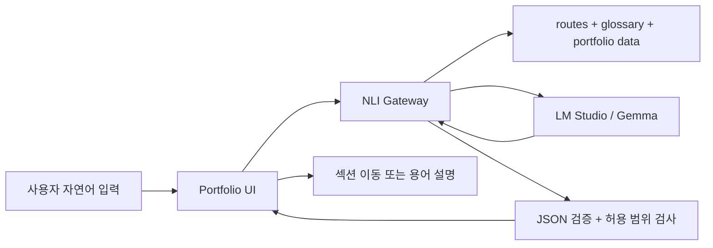

# Portfolio NLI MVP Plan

## 목표

포트폴리오 사이트에 붙는 NLI는 일반 챗봇이 아니라, 포트폴리오 탐색을 돕는 제한된 자연어 인터페이스입니다.

MVP에서 허용하는 기능은 세 가지입니다.

1. 사용자의 자연어 요청을 포트폴리오 섹션 이동으로 변환
2. 포트폴리오에 등장하는 전문 용어를 사전 기반으로 설명
3. 포트폴리오 데이터에 있는 프로젝트 섹션만 짧게 요약

그 외 요청은 명확하게 거절합니다.

## 구성 파일

- `nli/routes.json`: 이동 가능한 페이지와 프로젝트 섹션 ID 목록
- `nli/glossary.json`: 포트폴리오 전문 용어 사전
- `nli/intents.json`: MVP에서 허용하는 intent 목록
- `nli/response.schema.json`: 로컬 LLM이 반환해야 하는 JSON 응답 계약
- `nli/system-prompt.md`: LM Studio 모델에 주입할 시스템 프롬프트 초안
- `nli/test-cases.json`: 자연어 입력별 기대 intent 테스트 케이스

## 런타임 구조

브라우저가 LM Studio에 직접 요청하지 않고, 중간에 NLI Gateway 서버를 둡니다.



## Gateway 책임

Gateway는 모델보다 더 엄격해야 합니다.

- 시스템 프롬프트와 context를 조립합니다.
- LM Studio OpenAI-compatible API로 요청합니다.
- 모델 응답이 JSON인지 파싱합니다.
- `response.schema.json` 기준으로 응답을 검증합니다.
- `targetId`가 `routes.json`에 존재하는지 확인합니다.
- `term`이 `glossary.json`에 존재하는지 확인합니다.
- 실패하면 안전한 `reject_out_of_scope` 응답으로 바꿉니다.

현재 Gateway 초안은 `tools/nli-gateway.mjs`에 구현되어 있습니다. 기본 실행 명령은 다음과 같습니다.

```bash
node tools/nli-gateway.mjs
```

기본 환경 변수:

- `NLI_HOST`: `127.0.0.1`
- `NLI_PORT`: `8787`
- `LM_STUDIO_BASE_URL`: `http://192.168.0.58:1234/v1`
- `LM_STUDIO_MODEL`: `google/gemma-4-e4b`

## 응답 예시

섹션 이동:

```json
{
  "intent": "navigate",
  "confidence": 0.92,
  "targetId": "project-makertion-db",
  "message": "DB 성능 최적화 섹션으로 이동합니다."
}
```

용어 설명:

```json
{
  "intent": "define_term",
  "confidence": 0.91,
  "term": "P95",
  "message": "P95를 설명합니다.",
  "answer": "P95는 전체 요청 중 95%가 이 시간 안에 응답했다는 뜻입니다.",
  "relatedTargets": ["project-makertion-db", "project-makertion-cache"]
}
```

범위 밖 요청:

```json
{
  "intent": "reject_out_of_scope",
  "confidence": 1,
  "message": "이 포트폴리오의 프로젝트 이동, 프로젝트 요약, 등록된 용어 설명만 도와드릴 수 있습니다."
}
```

## 다음 구현 순서

1. 배포 환경에서 NLI Gateway 주소를 프론트 설정값으로 주입
2. 테스트 케이스를 실제 사용자 입력 로그 기준으로 확장
3. 운영 배포 시 Gateway를 포트폴리오 정적 서버와 같은 도메인 뒤에 연결
