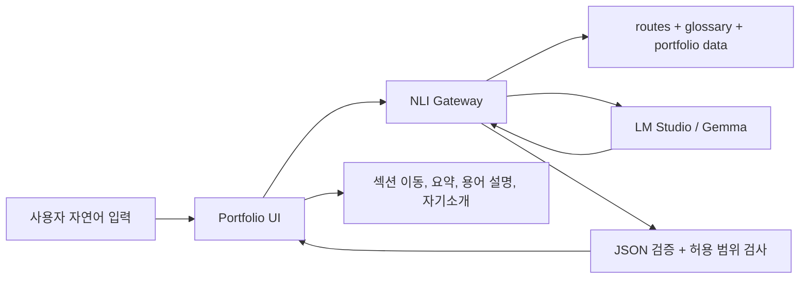

# Portfolio NLI MVP Plan

## 목표

포트폴리오 사이트에 붙는 NLI는 일반 챗봇이 아니라, 포트폴리오 탐색을 돕는 제한된 자연어 인터페이스입니다.

MVP에서 허용하는 기능은 열한 가지입니다.

1. 사용자의 자연어 요청을 포트폴리오 섹션 이동으로 변환
2. 포트폴리오에 등장하는 전문 용어를 사전 기반으로 설명
3. 포트폴리오 데이터에 있는 프로젝트를 짧게 요약
4. 포트폴리오 데이터에 있는 프로젝트 섹션을 짧게 요약
5. 포트폴리오 데이터 기반 자기소개 응답
6. NLI가 할 수 있는 기능 안내
7. 포트폴리오 전체 요약
8. 포트폴리오 목차 및 구성 안내
9. 공개 연락처 안내
10. 숫자로 검증된 주요 성과 안내
11. 기술/역량별 관련 프로젝트 경험 안내

그 외 요청은 명확하게 거절합니다.

## 구성 파일

- `nli/routes.json`: 이동 가능한 페이지와 프로젝트 섹션 ID 목록
- `nli/glossary.json`: 포트폴리오 전문 용어 사전
- `nli/intents.json`: MVP에서 허용하는 intent 목록
- `nli/response.schema.json`: 브라우저에 반환하는 canonical 응답 계약
- `nli/model-decision.schema.json`: 로컬 LLM이 반환하는 최소 결정 JSON 계약
- `nli/system-prompt.md`: prompt injection 방어와 최소 결정 출력을 요구하는 시스템 프롬프트
- `nli/test-cases.json`: 자연어 입력별 기대 intent 테스트 케이스
- `nli/live-test-cases.json`: 배포된 Gateway에 실행하는 live 검증 테스트 케이스
- `nli/adversarial-test-cases.json`: prompt injection·외부 주제 혼동을 막는 live 보안 케이스

## 런타임 구조

브라우저가 LM Studio에 직접 요청하지 않고, 중간에 NLI Gateway 서버를 둡니다.



## Gateway 책임

Gateway는 모델보다 더 엄격해야 합니다.

- 시스템 프롬프트와 context를 조립합니다.
- LM Studio OpenAI-compatible API로 요청합니다.
- 모델 응답을 최소 결정 JSON으로만 파싱합니다.
- 입력의 포트폴리오 근거와 모델 intent를 교차 검증합니다.
- `targetId`와 `term`을 allowlist로 확인한 뒤, 사용자 문장과 답변은 서버 데이터로 다시 생성합니다.
- 실패·범위 밖·지시 변경 요청은 모델의 자유형 문장을 사용하지 않는 canonical `reject_out_of_scope` 응답으로 바꿉니다.

현재 Gateway 초안은 `tools/nli-gateway.mjs`에 구현되어 있습니다. 기본 실행 명령은 다음과 같습니다.

```bash
node tools/nli-gateway.mjs
```

기본 환경 변수:

- `NLI_HOST`: `127.0.0.1`
- `NLI_PORT`: `8787`
- `LM_STUDIO_BASE_URL`: `http://192.168.0.58:1234/v1`
- `LM_STUDIO_MODEL`: `google/gemma-4-e4b`
- `LM_STUDIO_TIMEOUT_MS`: `8000`
- `NLI_MAX_REQUEST_BYTES`: `16384`
- `NLI_MAX_MESSAGE_LENGTH`: `500`
- `NLI_RATE_LIMIT_WINDOW_MS`: `60000`
- `NLI_RATE_LIMIT_MAX`: `30`
- `NLI_RATE_LIMIT_MAX_BUCKETS`: `10000`
- `NLI_REQUEST_TIMEOUT_MS`: `15000`
- `NLI_ALLOWED_ORIGINS`: production에서는 정확한 포트폴리오 origin 목록
- `LM_STUDIO_MAX_TOKENS`: `256`
- `LM_STUDIO_MAX_RESPONSE_BYTES`: `65536`
- `LM_STUDIO_MAX_CONCURRENT_REQUESTS`: `4`

예시 값은 `.env.example`에도 정리되어 있습니다.

## 응답 예시

섹션 이동:

```json
{
  "intent": "navigate",
  "confidence": 0.92,
  "targetId": "project-makertion-db",
  "message": "DB 성능 최적화 섹션으로 이동합니다."
}
```

용어 설명:

```json
{
  "intent": "define_term",
  "confidence": 0.91,
  "term": "P95",
  "message": "P95를 설명합니다.",
  "answer": "P95는 전체 요청 중 95%가 이 시간 안에 응답했다는 뜻입니다.",
  "relatedTargets": ["project-makertion-db", "project-makertion-cache"]
}
```

범위 밖 요청:

```json
{
  "intent": "reject_out_of_scope",
  "confidence": 1,
  "message": "이 포트폴리오의 프로젝트 이동, 프로젝트 요약, 등록된 용어 설명만 도와드릴 수 있습니다."
}
```

프로젝트 요약:

```json
{
  "intent": "summarize_project",
  "confidence": 0.9,
  "targetId": "project-catequest",
  "message": "CateQuest 프로젝트를 요약합니다.",
  "answer": "CateQuest는 사용자 맞춤 카테고리별 질문 생성 프로젝트입니다."
}
```

자기소개:

```json
{
  "intent": "introduce_profile",
  "confidence": 0.94,
  "message": "이은성을 소개합니다.",
  "answer": "이은성은 Backend & Infra Developer입니다."
}
```

NLI 도우미 자기소개:

```json
{
  "intent": "list_capabilities",
  "confidence": 0.96,
  "message": "포트폴리오 도우미를 소개합니다.",
  "answer": "저는 포트폴리오 도우미에요. 원하는 자료를 말하시면 이동을 해드리거나, 해당 프로젝트 내용 요약, 등록된 용어를 설명해드릴 수 있어요."
}
```

기능 안내:

```json
{
  "intent": "list_capabilities",
  "confidence": 0.96,
  "message": "도우미가 할 수 있는 일을 안내합니다.",
  "answer": "전체 요약, 목차, 연락처, 주요 성과, 기술별 경험, 프로젝트 이동, 프로젝트 요약, 섹션 요약, 등록된 용어 설명, 자기소개를 도와줄 수 있습니다."
}
```

## 근거 기반 답변과 대화 문맥

`answer_portfolio`는 한 가지 intent에 맞춘 고정 문구가 아니라, 포트폴리오 근거 안에서 한국어로 자유롭게 서술하는 응답입니다. 모델에는 Gateway가 검색한 후보 근거와 해당 ID만 전달됩니다. 모델의 `sourceIds`는 후보 집합, 중복, 개수 제한을 통과해야 하며, 브라우저로 보내는 `sources`의 label은 Gateway가 포트폴리오 target에서 다시 만듭니다.

```json
{
  "intent": "answer_portfolio",
  "confidence": 0.9,
  "answer": "DB 튜닝과 메인 홈페이지 캐싱, N+1 쿼리 개선 사례를 비교해 설명합니다.",
  "sources": [
    { "id": "project-makertion-db", "label": "DB 성능 최적화" }
  ]
}
```

성능, AWS, 관측성, 동시성, Redis/Valkey, CI/CD, 비용, AI/LLM, 데이터 모델링 같은 범주는 별도의 고정 intent로 분기하지 않습니다. 검색 점수와 현재 근거에 따라 후보를 자동 선택하고, fixture는 source ID 및 답변의 포함/제외 문구로 결과를 검증합니다. 직접 이동과 용어 설명은 기존의 결정적 로컬 해석을 우선합니다.

브라우저 요청은 `{ message, currentTargetId, history }`이며, `history`에는 완료된 최근 user/assistant 메시지 최대 6개만 `{ role, text }`로 포함됩니다. Gateway는 사용자별 대화를 저장하지 않습니다. 형식이 잘못된 history, 너무 큰 history, prompt injection은 HTTP 경계에서 거절됩니다. 현재 위치와 유효한 최근 대화는 후속 질문의 근거 검색에만 사용합니다.

UI는 `answer_portfolio.sources`를 근거 버튼으로 렌더링하고 클릭할 때만 해당 섹션으로 이동합니다. 답변의 렌더링 자체는 자동 스크롤하지 않습니다. 모든 답변과 label은 text API로 렌더링하므로 HTML로 실행되지 않습니다.

모델 timeout, malformed JSON, 후보 밖 source ID, 검증되지 않은 intent는 로컬 fallback이 있으면 그 결과로, 없으면 canonical `reject_out_of_scope` 응답으로 바꿉니다. 모델의 원본 응답은 이 검증을 통과하지 않으면 브라우저에 전달되지 않습니다.

## 검증 원칙

- `nli/grounded-category-test-cases.json`은 fake model로 성능, AWS, 관측성, 동시성, Redis/Valkey, CI/CD, 비용, AI/LLM, 데이터 모델링, 전체 소개와 문맥 후속 질문을 검증합니다. source ID, 포함/제외 문구, timeout·잘못된 source ID·잘못된 history fallback도 포함합니다.
- `node --test tools/*.test.mjs`와 `node --test tools/nli/*.test.mjs`는 Gateway HTTP 경계와 모델 계약, retrieval, history, evidence ranking, 배포 lifecycle, 정적 서버를 함께 실행합니다. 배포 preflight는 이어서 UI browser regression harness를 별도로 실행합니다. Chrome-capable Playwright module이 주입되지 않은 기본 환경에서는 browser regression이 명시적으로 skip되며, 이를 실제 Chrome 검증으로 간주하지 않습니다.

- 로컬 라우팅 fixture는 100% 통과해야 합니다.
- fake LM Studio 기반 `node --test tools/nli-gateway.test.mjs`는 모델 출력 반사, 모델 경로의 범위 혼동, HTTP 제한을 결정적으로 검증합니다.
- 배포 후 기능 fixture는 모델 품질 변동을 고려해 90%를 허용할 수 있지만, adversarial fixture는 100% 통과해야 합니다.
